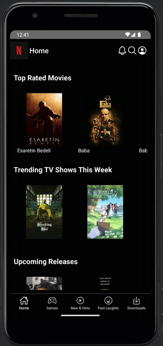

şuan okay mi # 📱 React Native Firebase Messaging App

This project is a mobile application built with **React Native**.  
It integrates **Firebase Cloud Messaging (FCM)** to receive push notifications,  
handles **Deep Linking** to navigate to specific screens when a notification is tapped,  
and uses **Redux Toolkit** for global state management.  
All incoming notifications are also stored in **Firebase Firestore** and can be listed in the app.  
The project is structured based on the **MVVM** architecture.

---

## 🚀 Features

- **Firebase Cloud Messaging** integration
- Handles notifications when the app is **foreground**, **background**, or **closed**
- Navigates to the relevant screen when a notification is tapped (**Deep Linking**)
- Saves all notifications to **Firebase Firestore** and displays them in a list
- **Redux Toolkit** for global state management
- Organized folder structure based on **MVVM** architecture
- API requests managed in the `services` layer
- Modern navigation system using **React Navigation**
- **Type-Safe** state management and API calls (RTK + Axios)
- User-friendly UI and modular code structure

---

## 🛠 Technologies & Dependencies

```json
"@react-native-firebase/app",
"@react-native-firebase/firestore",
"@react-native-firebase/messaging",
"@react-native/new-app-screen",
"@react-navigation/bottom-tabs",
"@react-navigation/native",
"@react-navigation/native-stack",
"@reduxjs/toolkit",
"axios",
"firebase",
"react",
"react-native",
"react-native-gesture-handler",
"react-native-safe-area-context",
"react-native-screens",
"react-native-vector-icons",
"react-redux" ```


# rn-firebase-netflix-clone